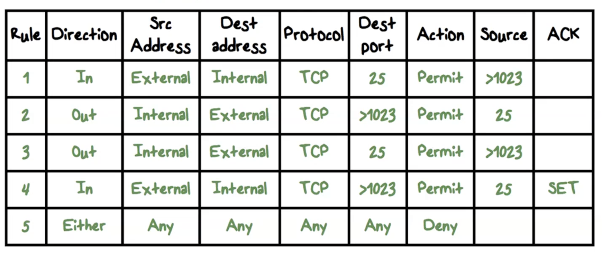
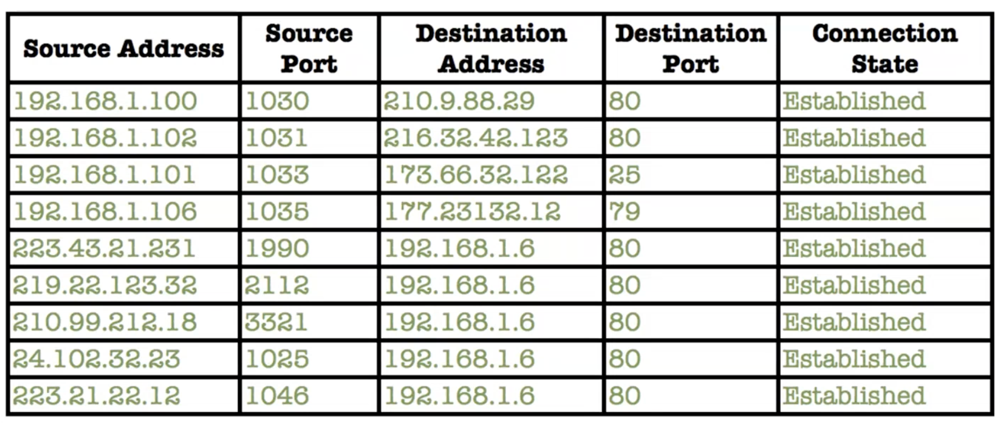
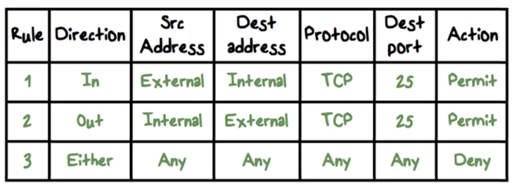
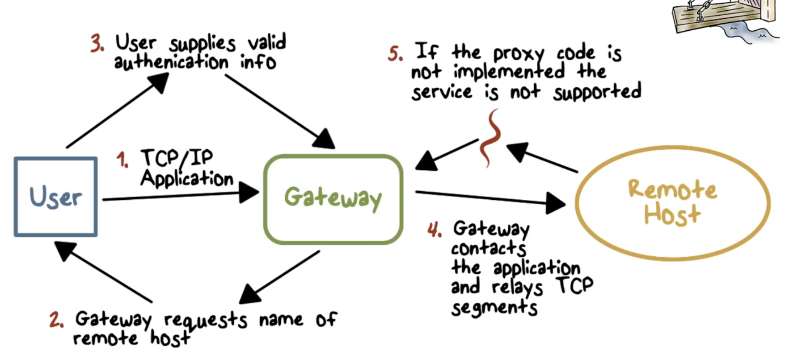
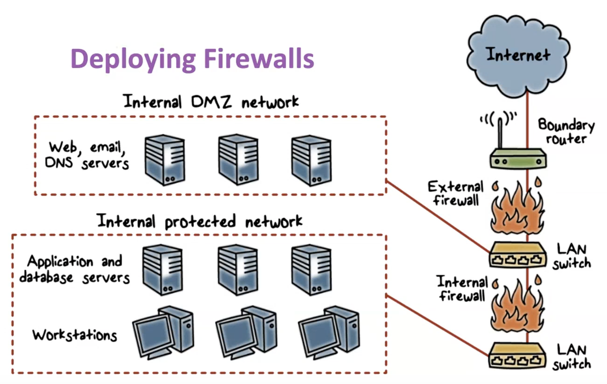
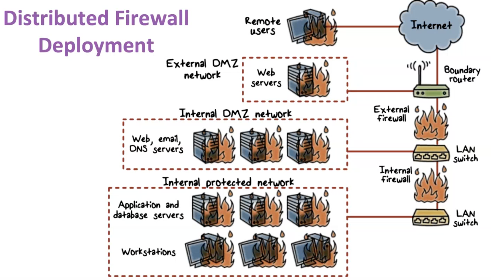

# Firewalls
- defense mechanisms:
    - prevent, detect, then survive last
- firewalls basically filter network traffic to allow only certain connections/data through
- design goals
    - enforcement of security policies
        - all traffic from internal network to internet and vice versa must pass through firewall
        - only traffic authorized by policy is allowed
    - dependable
        - firewall immune to subversion
- Access policy - lists types of traffic allowed through firewall
    - developed from organization's security risk policies, and specifies which traffic types the org needs to support
        - refined to detail the filter elements that can be implemented within an appropriate firewall structure
- Limitations
    - cannot protect traffic that does not cross it (internal traffic, routing around firewall)
    - misconfigure
- additional good features
    - gives insight into traffic via logging
    - network address translation
        - bunch of computers behind publicly facing IP address
    - encryption
## Firewalls and Filtering
- packets checked then passed
- inbound/outbound affect when policy is checked

### Filtering Types
- **packet filtering**
    - access control lists
    - decisions made on per packet basis
    - no state info saved
- **session filtering/stateful filtering**
    - dynamic packet filtering
    - stateful inspection
    - context based access control
#### Packet Filtering Firewall
- applies rules to each incoming/outgoing IP packet
        - typically a list of rules based on info in the packet header
            - source address, destination address, source/destionation transport level address, IP protocol field, interface
        - forwars/discards packet if rules match or not
- two default policies:
    - discard - prohibit unless expressly permitted (more conservative, controlled)
    - allow - permit unless expressly prohibited
        - easier to mange but less secure
- typical configuration
    - if dynamic protocols in use, entire ranges of ports must be allowed
    - ports > 1024 are left open
- advantages
    - simplicity
    - transparent to users and very fast
- weaknesses
    - cannot prevent attacks that employ app specific vulnerabilites/funcitons
    - limited logging functionality
    - vulnerable to attacks/exploits that take advantage of TCP/IP
    - vulnerable to improper configurations - easy to misconfigure
- example: filtering for outbound email and inbound email
    - can clearly see that configuring the firewall to allow these packets is complicated

### Stateful Inspection Firewall
- tightens rules for TCP traffic by creating directory of TCP connections
    - entry in directory for each current connection
    - packet filter allows incoming traffic to high-numbered ports only for packets that fit profile of one of the entries in the directory
- Reviews packet info and records info about TCP connections
    - keeps track of TCP sequence numbers to prevent attacks that depend on seq number
    - inspects data for correct protocols
- connection state table

- now, when configuring our firewall, much more simple with connection state table

## App-Level Gateway

- also called application proxy
- acts as relay for application-level traffic (typically system in the middle)
    - user typically sends info to gateway, then gateway applies all the protocols and sent to the other server
- must have proxy code for eacch application
    - may restrict application features
    - more secure than packet filters
- weaknesses
    - additional processing overhead for each connection
    - hard to scale/less flexible

## Bastion Hosts
- serves as platform for app-level gateway
- identified by system as strong point in network's security
- characteristics
    - runs secure OS, only essentials
    - may require user authentication to access host/proxy
    - each proxsy can restrict features
    - each proxy is small, simple
    - limited disk use (read only code)
    - each proxy runs as a non-privelaged user in private and secured directory on bastion host

## Host-Based Firewall
- used to scure individual host
- available in OSs/provided as an add-on package
- filter/restrict packet flows
- common location is a server
- advantages
    - filtering rules can be tailored to host environment
    - protection is provided independent of network structure
    - provides additional layer of protection
- personal firewalls
    - used for a specific device/laptop
    - typically less complex
    - role is to mainly filter inbound traffic and not outbound traffic

## Deploying Firewalls
- DMZ - separates the things that must be public facing
    - web/email/DNS servers
- need internal firewall to protect internal network in case someone compromises our DMZ
- need external firewall to protect our DMZ

## Internal Firewalls
- purposes
    -  can add more stringent filtering capabilities
    -  provide 2 way protection with respect to DMZ
    -  multiple firewalls can be used to protect portion of internal network from each other
### Distributed Firewall Deployment

- allows for security monitoring

## Typical Firewall Topologies
- host-resident - includes personal firewall software and firewall software on servers
- screening router - single router between internal and external networks with stateless/full packet filtering
- single bastion inline - single firewall device between internal and external router
- single bastion T - 3rd network interface on a bastion to a DMZ where externally visible servers are placed
- double bastion inline - DMZ in between 2 bastion firewalls
- double bastion T - DMZ on separate network interface on bastion firewall
- distributed firewall config - used by large business/govt orgs