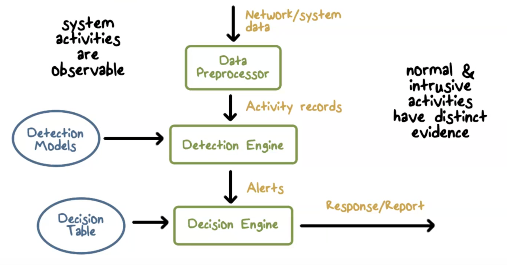

# Intrusion Detection
- examples of intrusion
    - guessing pwds
    - impersonating user to get info
    - using unattended workstation
    - distributing pirated software

## Intrusion Detection Systems
- designed to counter threats
- assumptions
    - system activites are observable
    - normal/instrusive activites have distinct evidence
    - from an algo perspective
        - features - capture intrusion evidence
        - models - piece evidence together
    - from a system architecture perspective
        - audit data processor, knowledge base, decision engine, alarm generation and responses (how do I alert once I found an intrusion?)
            - how should you build the system to find these intrusions

## Detection Approaches
- Modeling and analysis
    - misuse detection (signature based)
    - anomaly detection
- deployment
    - host-based
    - network-based
- development and maintenance
    - hand-coding of expert knowledge
    - learning based on data (ML)
### Analysis Approaches
- anomaly detection
    - involves collecting data relating to behavior of legitimate users over a period of time
    - current observed behavior is analyzed to determine whether or not it is from a legitimate user
- misuse/signature detection
    - uses set of known malicious data patterns/attack rules that are compared with current behavior
    - can only identify known attacks which have patterns/rules
### Classification Approaches - Anomaly detection
- issues affecting performance
    - efficiency/cost of detection
#### Statistical approach
- used captured sensor data
- multivariate models using time and order of event
- advantages:
    - simple
    - low computation cost
    - lack of assumptions about expected behavior
- disadvantages
    - difficult to select suitable mettrics
    - not all behaviors can be modeled this way
#### Knowledge Based Approach
- developed during training to characterize data into distinct classes
- pros
    - robust
    - flexible
- cons
    - time/difficulty required to develop knowledge from data
    - human experts must assist with process
#### ML approach
- use data mining techniques to develop a model that can classify data as normal or anomalous
- pros
    - flexible
    - adaptable
    - ability to capture interdependencies between metrics
- cons
    - dependency on assumptions about accepted behavior
    - high false alarm rate
    - high resource cost
    - lots of time/computation resources
- bayesion networks
    - probabilistic relationships among metrics
- markov model
    - develop probabistic model with sets of states
- neural nets
- clustering/outlier detection
    - group data into clusters and identify other data as belonging to cluster or outlier
### Limitations of Anomaly Detection
- trained on legit data
    - limits effectiveness of techniques

### Signature Approaches
- match large collection of known patterns of malicious data against data stored in system or transit over a network
    - need to be large enough to minimize false alarm rate while detecting large fraction of malicious data
- used widely in antivirus products, network intrusion detection
- pros
    - lost cost and resources
    - wide acceptance
- cons
    - significant effor to identify and review new malware to create signatures
    - cannot detect zero day attacks

#### Rule based Detection
- involves use of rules for identifying known penetrations that would exploit known weaknesses
- rules can also identify suspicious behavior
    - typically specific
- can't detect new attacks

## Monitoring Networks/Hosts
- IDS performs passive monitoring
    - records/analyzes data bout system/network activity
    - if IDS sends out alert and response policy dictates intervention, then activies are affected

### Network Based Intrustion Detection (NIDS)
- monitors traffic at selected points on a network in real/lose to real time
    - examine networks, transport, app level protocol activity
- comprised of a # of sensors, one or more servers for NIDS management functions, and on or more management consoles for the human interface
- analysis of traffic patterns may be doen at the sensor, server or both
- network IDS 
    - place system at entry point into network
- host IDS
    - look at processes running on host device

#### Inline Sensors
- used to block attack when one is detected, performing both intrustion detection and prevention
- inserted into network segment so that traffic that it is monitoring must pass through sensor
- achieved by combining NIDS sensor logic with firewall/lan switch
    - or using stand alone inline NIDS sensor
#### Passive Sensors
- monitors a copy of network traffic
    - actual traffic doesn't pass through device
    - more efficient

## Firewall Vs Network IDS
- firewall
    - active filtering
    - fail-close - if you don't know what to do, don't allow it
- network ids
    - passive monitoring
    - fail-open - allow if don't know what to do
## NIDS Sensor deployment
- have internal and external sensor

## SNORT
- open source 
- highly configurable
- lightweight ids

## Honeypots
- decoy systems designed to lure attackers away from critical systems
- designed to
    - divert attacker
    - collect info on attacker
    - encourage attacker to stay long enough for sys admins to respond
- filled with fabricated info
- any accesses to honeypot trigger monitors/event loggers
- attack against honeypot made to seem successful
- no production value
- no legit reason to access honeypot
    - any attempt to communicate with honeypot is most likely probe, scan or attack
- if honeypot initiates outbound traffic, most likely system is compromised
- low interaction honeypot
    - emulates services/system well enough to provide initial realistic interaction, but does not execute full version of those services
    - less realistic target
    - sufficient for use as component of distributed IDS to warn of attack
- high interaction honeypot
    - real system with full OS/services
    - more realistic
    - more resources required
- can be deployed inside network to simulate workstation
- can put in DMZ to see if people will attack web interfaces
- can put outside firewall to see who's trying to get in
## Evaluating IDS
- system should be scalable/resilient to attacks
- true positive rate - how likely will IDS correctly output alert given intrusion
- false negative rate = 1 - true positive rate
- bayesian detection rate - given that IDS produces alert, how likely did intrusion actually occur?
- formulas:
    - alarm/positive: A, intrusion: I
    - true positive rate: P(A | I)
    - bayesion detection rate: P(I | A) = P(I)P(A|I) / P(I)P(A|I) + P(~I)P(A|~I)
        - P(I) is prior probability of attacks
- base rate fallacy
    - even if false alarm rate is low, bayesian rate can still be low if base rate P(I) is low
- when IDS produces alert, probability that intrusion actually occurred is low
    - implies that algorithms need to be designed to reduce false alarm rate
    - deploy IDS to appropriate layer with high enough base rate
    - multiple independent detection models
- architecture of network IDS
    - packet data volume can be large
    - base rate at packet level is low
    - applying detection algos at this level may result in low bayes detection rate
## Network IDS Downfalls
- IDS may not see what end system gets 
    - due to differing protocols in OSs
- Denial of service attacks
    - resource exhaustion (CPU, memory, network bandwidth)
    - abusing reactive IDS (detects things too reactively)
        - false positives, nuisance attacks