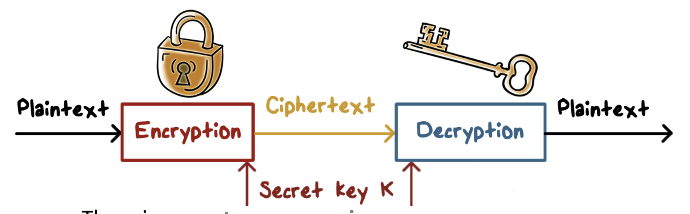

# Intro to Cryptography

## Encryption/Decryption
- 1 to 1 mapping
- provides confidentiality protection
- integrity checking
    - no tampering
- authenticity
    - verified authorship
- authentication 
    - not impersonating someone
- symmetric ciphers
    - used for data/traffic
- asymmetric ciphers
    - used for authenticdation, key exchange, digital signatures

## Attack On Encryption
- breaking cipher
    - uncover plaintext from ciphertext, or alternitavely, discovering the key
- attack types
    - brute force - try all keys
    - cryptanalysis - analysis of algo and characteristics
    - implementation attacks - side channel analysis
    - social-engineering attacks

## Simple Ciphers
- Caesar's cipher - shift letters by an offset n
    - (letter + n) % 26
- monoalphabetic cupher
    - generalization: arbitrary mapping of one letter to another
    - 26! combos
    - attack with statistical analysis of letter freqs
        - most common plaintext letters and words
        - most common word is "the"
    - example: try to crack "WAIT IT WAS SOD"
        - assume that "WAS" = THE
        - "TH__ __ THE E__"
        - last 2 letters of first word and 2nd word are both "IT"
        - choose is
        - "THIS IS THE E__"
            - last part is arbitrary
- vigenere cipher
    - tables with encodings (2 letter pair - 1 for key letter, 1 for plaintext letter), create a key, encode each letter until you have ciphertext

## What Should Kept Secret
- Kerckhoff's principle: cryptosystem should be secure even if the attacker knows all details about system, except exception of secret key
- use only widely known cipher that have been analyzed and proven

## Types of Cryptography
- secret key cryptography (symmetric) - 1 key for encrypt and decrypt
- public key crypto (asymmetric) - 2 keys
    - public for encryption, private for decryption
    - private for signing and public for verification
## Hash Function
- compute message digest of data of any size, and produce fixed length output
- should be easy to compute hash
- should be one way
- given message 1, it is computationally infeasible to find another message where it's hash is the same as message 1
    - weak collision resistant
- computationally infeasible to find any pair of messages that produce the same hash
    - strong collision resistant

## Digital Signatures
- provide authenticity to a message cryptographically, saying it has not been altered
- hash message, then perform crypto operation on the hash 

## Digital Envelopes
- protects message without needing to first arrange for sender and receiver to have same secret key