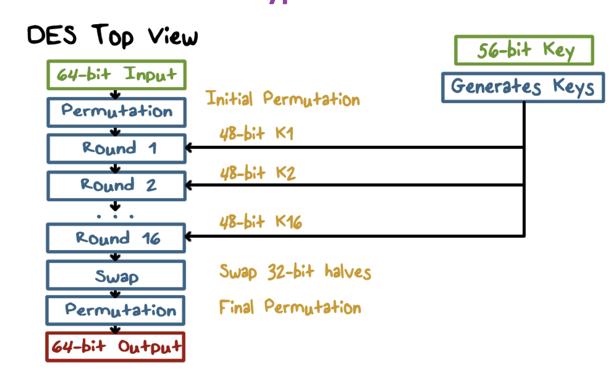
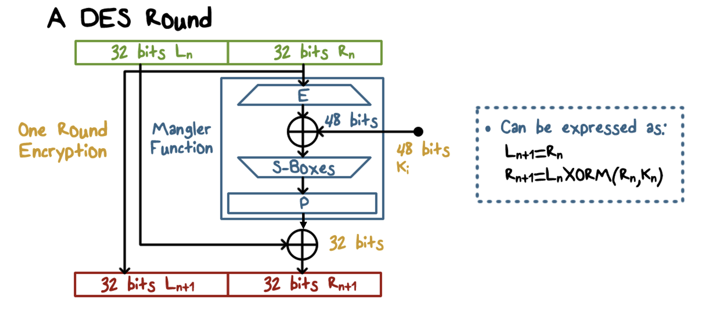
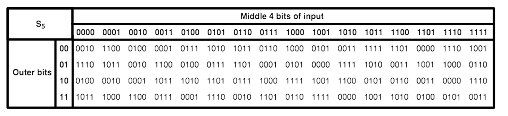
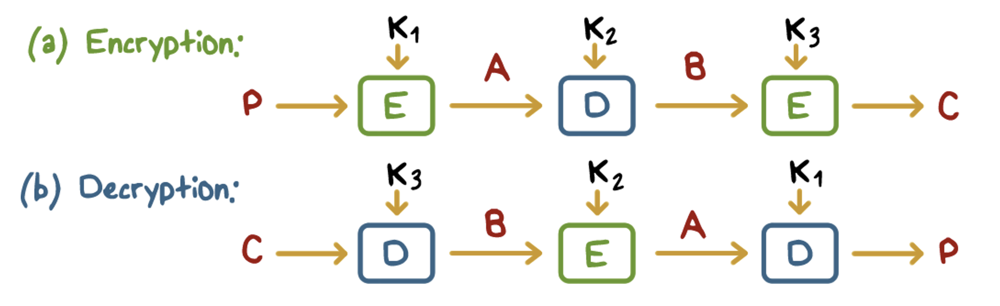
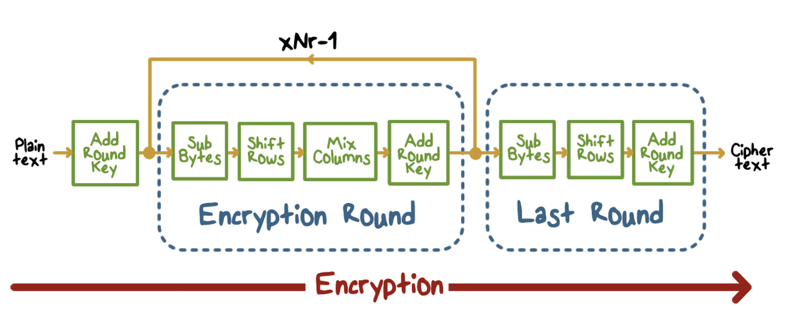
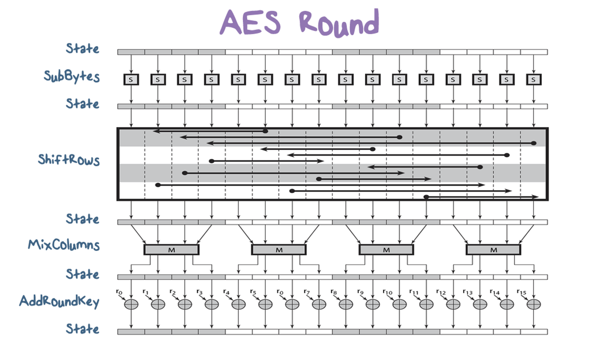
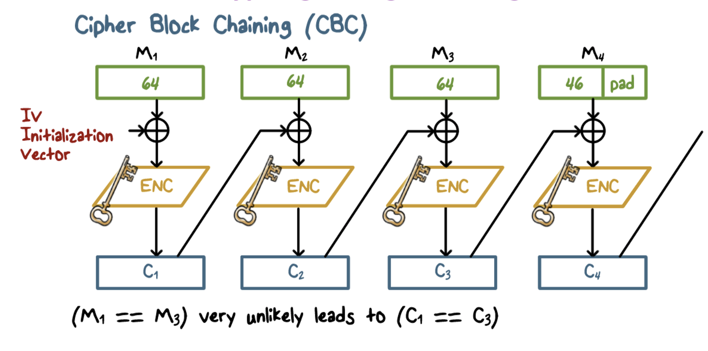

# Symmetric Cryptography

## Block Cipher Primitives
- confusion:
    - an encryption operation where the relationship between key and ciphertext os obscured (achieved using substitution)
- diffusion:
    - operation where influence of 1 plaintext bit is spread over many ciphertext bits with the goal of hiding statistical properties of plaintext (avoid common letter distributions)
        - achieved using permutations
- round - combo of substitution and permutation

## Data Encryption standard (DES)
- Key: 64 bit quantity - 8 parity bits (used for checking), 56 bits for key
    - every 8th bit is parity
- 64 bit input, 64 bit output
- has to be reversible

- initial permutation - change up positions of bits

- right 32 bits are expanded to 48 bits, and XOR with key
- then, we compress 48 bits to 32 using s-box
- then, we XOR with the left 32 bits, and make that right 32 bits of output
- we make the right 32 bits the 32 left bits of output
### Decryption
- apply same operations key sequence in reverse
    - round 1 of decrypt uses last key of encryption
- each round
    - input: R_n+1 | L_n+1 (due to swap operation at end of encryption)
    - output: R_n | L_n
    - swap at end will produce correct result
### S-Box 
- subsitute and shrink
- go from 48 bits to 32 bits
- 2 bits used to select from 4 substitutions for the rest of the 4 bit quantity

- input: 011011
    - grab 4 middle bits of input 0(1101)1, look at that column in table
    - look at outer 2 bits (0)1101(1), look at that column
    - select that cell as your result! 
    - output: 1001
### Security of DES
- Key space is too small (2^56 keys)
    - easy to brute force
- s-box design criteria have been kept secret - big problem and violates principles of security
- highly resistant to analysis techniques

## Triple DES

- k1=k3 results in a 112 bit DES - big key space
- distinct k1-k3 results in even stronger 168 bit DES
- can run as a single DES if k1=k2
- problem: this is slow

## Advanced Encryption Standard (AES)
- 128, 192, 256 key length

- XOR with key at very end
- very efficient, built with hardware in mind
## Encrypting a Large Message
- break message into blocks, apply block cipher onto blocks
    - electronic code book (ECB)
- problems:
    - if block1 plaintext = block2 plaintext, then ciphertext will be the same!
    - doesn't have basic protection against integrity attacks at the message level (we want small changes to affect entire cipher text dramatically)
        - can have cipher block substitution and rearrangement attacks, fabrication of info

### Cipher Block Chaining Decryption (CBC)
- use an initialization vector, and the ciphertext of the preceding block is mixed in the initialization vector for the next block

- problem: if we use the same key and the same initialization vector, we can tell if 2 messages start the same way (must change IV each time)
### General K-Bit Cipher Feedback Mode (CFB)
- take IV (must be kept secret), encrypt it, then XOR with message block

### Protecting Message Integrity
- only send last block of CBC along with the plaintext (CBC residue)
- any modification in plaintext results in a CBC residue that is different from the one computer by the receiver, ensures integrity
- simply sending all CBC blocks for confidentiality instead of plaintext does not work
    - should use 2 seperate secret keys
        - 1 for encryption
        - 1 for generating residue
    - or, use CBC(message | hash of msg)