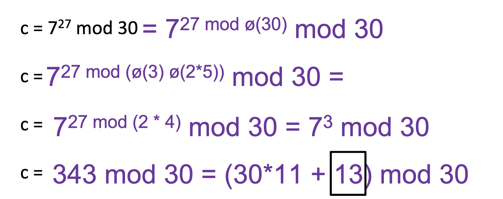
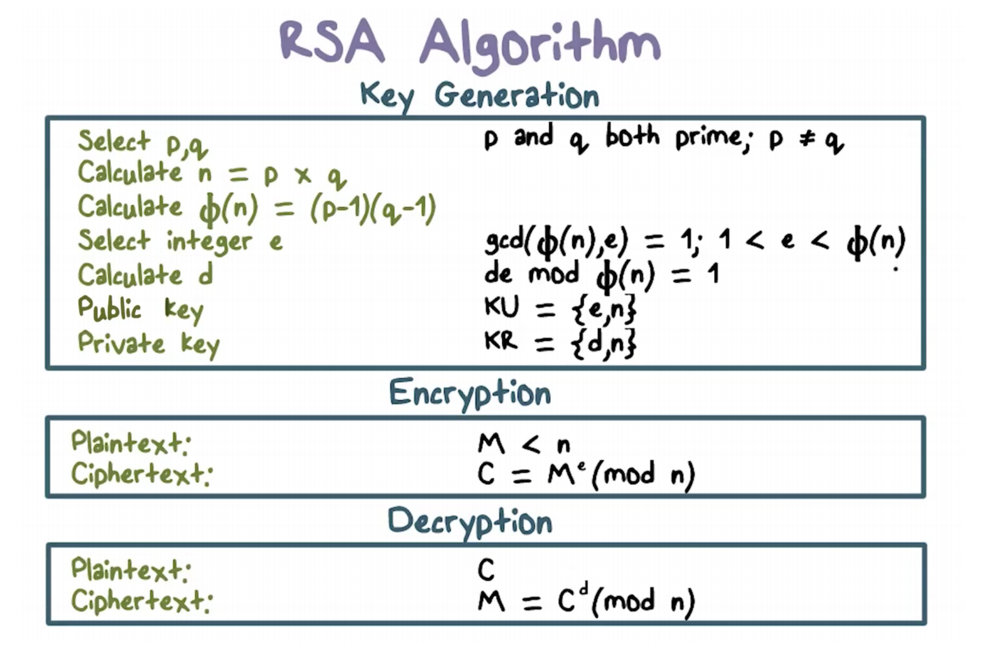
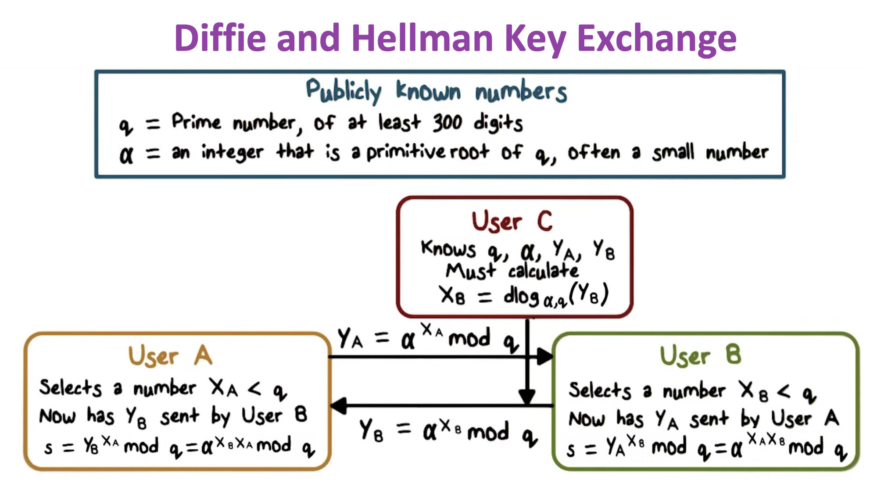
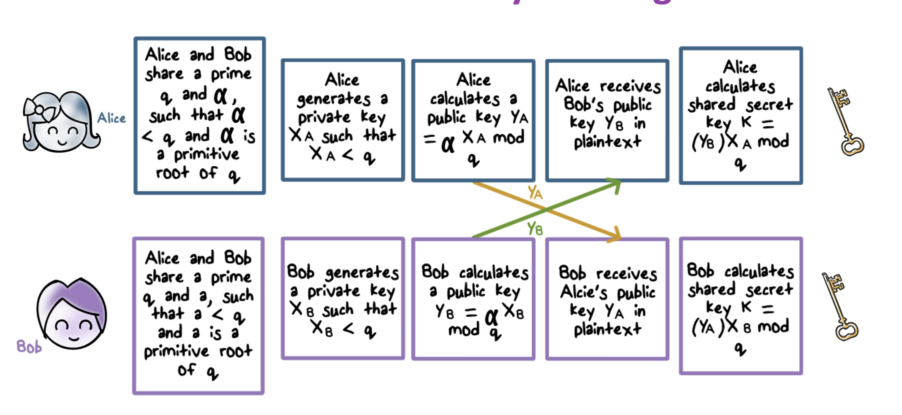

# Public Key Cryptography
## Modular Arithmetic
- public key algos based on modular arithmetic
- mod = remainder
### Modular Addition
- additive inverse: addition mod m = 0
    - i + i^-1 mod m = 0
    - ex) 2 mod 10 inverse
        - inverse is 8 bc 8 + 2 = 10, and 10 mod 10 is 0
- addition is reversible because of this additive inverse
    - convenient for decryption
    - `c = p + k mod m` where c = ciphertext, p = plaintext, k = key
    - given ciphertext and key, we want plaintext back
        - simply do `c + k^-1 mod m`
            - `c + k^-1 mod m = p + k mod m + k^-1 mod m = p`
    - example: p = 3, k = 2, m = 10
        - c = 3 + 2 mod 10 = 5
            - create ciphertext
        - p = 5 + 8 mod 10 = 3
            - 8 is inverse of 2 mod 10

### Modular Multiplication
- multiplicative inverse multiplication mod m = 1
    - ex) If M = 10, 3 and 7 are inverse of each other bc 3 * 7 mod 10 = 1
    - only some numbers have inverse
- use euclid's algorithm to find inverse
    - given x, n, find y such that x * y mod n = 1
- only number relatively prime (gcd is 1) to n have mod n multiplicative inverse
- example: what is muliplicative inverse of 3 mod 17?
    - 3 * ? mod 17 = 1
    - 3 * ? = 18 (because 1 also equals 18 in modspace 17)

### Totient Function
- number of integers smaller than n and relatively prime to n (Φ(n))
    - if x is prime, Φ(n) = n - 1
    - if n = pq, and p, q are primes, then Φ(n) = (p-1)(q-1)
    - if n = pq, and p, q are relatively prime to each other, then Φ(n) = Φ(p)Φ(q)
- ex) What is Φ(21)?
    - p = 3, q = 7, both prime
    - 2*6 = 12 = Φ(21)

### Modular Exponentiation
- x^y mod n = x^ymodΦ(n) mod n
- if y = 1 mod Φ(n) then x^y mod n = x mod n
- example:
    - first, split up Φ(30) into Φ(3) * Φ(10), 3 and 10 are relatively prime
        - Φ(3) = 2, Φ(10) = (5-1)(2-1) = 4
    - 3rd line: 27 mod 8 is 3

## RSA
- Rivest, shamir, adleman
- widely used
- supports both public key encryption and digial signature
- assumes that factoring a very large integer is NP hard
- variable key length
- variable plaintext block size
    - plaintext treated as an integer, must be smaller than the key
    - ciphertext block siize is same as the key length

### RSA Algo

- key generation
    - select p, q (both prime, p != q)
    - calculate n = pq
    - Φ(n) = (p-1)(q-1)
    - select integer e such that `gcd(Φ(n), e) = 1, 1 < e < Φ(n)`
    - calculate d such that `de mod Φ(n) = 1`
    - public key: KU = {e, n}
        - if you do not know factorization of n, then you cannot calculate totient of n, and cannot go from e to d
    - private key: {d, n}
- encryption:
    - given message M < n, `C = M^e mod n`
- decryption
    - given C, `M = C^d mod n`

### Why does RSA Work?
- given public key = (e, n) and private key = (d, n), n = pq, Φ(n) = (p-1)(q-1)
    - `ed mod Φ(n) = 1`
    - `x^ed mod n = x mod n`
    - `x^ed mod n = x^(ed mod Φ(n)) = x mod n`
    - remember, encryption: `c = M^e mod n`, decryption: `M = c^d mod n`
        - `c^d mod n = m^(ed) mod n` - using `c = M^e mod n`
        - `m^(ed) mod n = m^(ed mod Φ(n))` - totient property
        - `m^(ed mod Φ(n)) = m mod n` - `ed mod Φ(n) = 1`
        - `m mod n = 1` - since m < n
- example:
    - p = 3, q = 11
    - n = 33
    - Φ(n) = 20
    - assume e = 7, d = 3 (7*3 mod 20 = 1)
    - public key: e = 7, n = 33
    - private key: d = 3, n = 33
    - if m = 2, encryption is 2^7 mod 33 = 29 = ciphertext
    - if ciphertext is 29, 29^3 mod 33 = 2 = message
### RSA Security
- factoring a 512 bit integer is very hard
    - crucial, otherwise you can calculate p and q to calculate Φ(n)

### RSA In Practice
- schoolbook RSA issues
    - deterministic - for the same key, a given plaintext always mapped to same ciphertext
    - special case plain texts 0,1,-1 produce 0,1,-1 regardless of key
    - malleable - transforming ciphertext into another leads to predictable transformation to plaintext
- PKCS - public key cryptographic standard uses OAEP (optimal asymmetric encryption padding)
    - appended padding from random byte as prefix to m
    - typically used to establish keys for symmetric encryption, not for the whole process of encrypting itself

## Diffie and Hellman Key Exchange
- first public public-key algo
- practical method to exchange a secret key
- security relies on difficulty of computing discrete logarithms
  
### Diffie-Hellman Security
- shared key itself is never transmitted
- discrete logarithm is very hard
- `y = a^x mod q`
    - given Y,a, and q, t is extremely hard to compute value of X because Q is a very large prime

### Diffie Hellman Process

- publicly known numbers: 
    - q - prime number, at least 300 digits
    - α - primitive number (can produce lots of different outputs when raised to a power), often very small
- user A selects an integer X_a which is less than q
- user B selects an integer X_b which is less than q
- user A sends Y_a = α^(X_a) mod q to user b
    - user B's secret number = s = Y_a^(X_B mod q)
- user B sends Y_b = α^(X_b) mod q to user a
    - user A's secret number = s = Y_b^(X_A mod q)
- q = α^(X_a * X_b) mod q
- even if 3rd user knows q, α, Y_a, Y_b, must calculate X_b = dlog_(α, q)(Y_b)
    - very difficult

- example:
    - if q = 23, α = 5, X_a = 6, X_b = 15
    - a sends b 5^6 mod 23 = 8
    - b sends a 5^15 mod 23 = 19
### Implementing Diffie Hellman

### Limitations
- exponentiation is expensive
    - DoS attacks possible
- process does not encrypt any data - only to establish secret key
- no authentication
    - can lead to monst in the middle attack, where a and b agree upon key, but actually a agrees with c, and c agrees with b

## Elliptic Curve Cryptography (ECC)
- equal security for smaller bit size than RSA
- based on elliptic curve