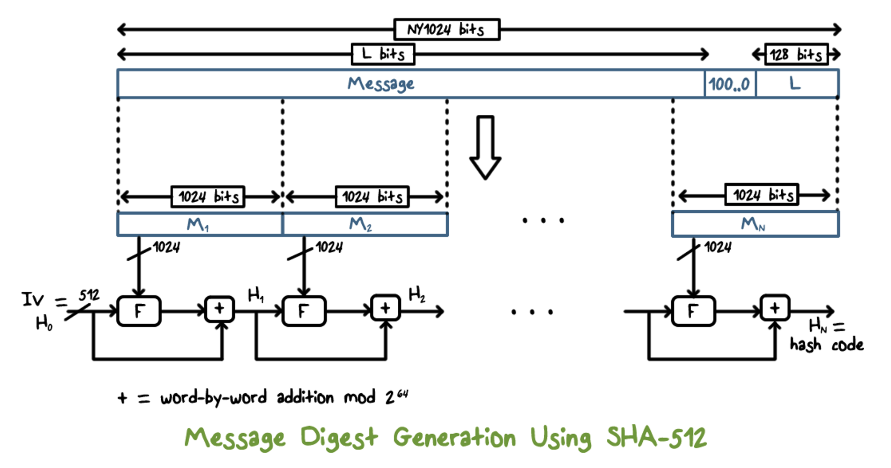
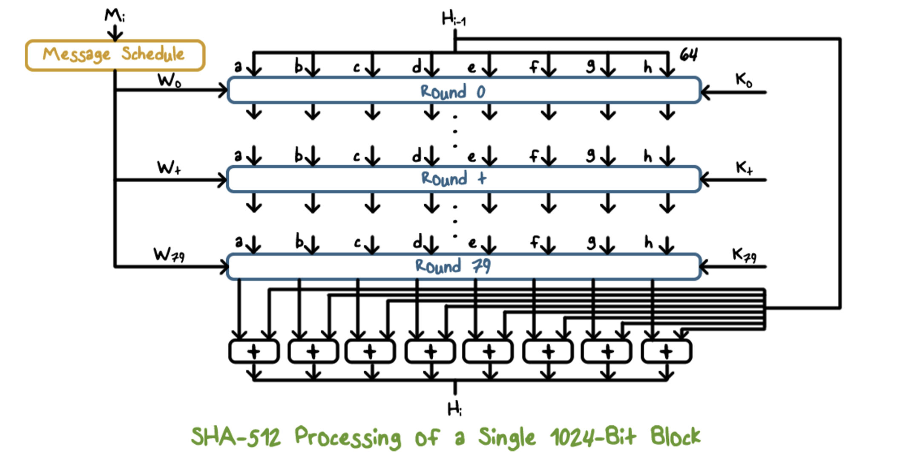

# Hashes
- compute message digest of any size data
- fixed length: 128-512 bits
- easy to compute
- one way function - given H(m), hard to find m (can't go backwards)
- given message 1, it is computationally infeasible to find another message where it's hash is the same as message 1
    - weak collision resistant
    - if hash function does not do this, then someone could simply forge an unencrypted message with the same hash value and disguise it as authentic message, given that the attacker knows the message that is being sent (attacker controls only 1 message)
- computationally infeasible to find any pair of messages that produce the same hash
    - strong collision resistant
    - if hash function does not do this, then someone could simply create a new message that hashes to the same value as the original, and sends that instead (attacker controls both messages)

## Hash Function Weaknesses
- pigeonhole principle
    - n = # of pigeons, m = # of holes
    - if n = m, 1 pigeon/hole
    - if n > m, 1 hole must have more than 1 pigeon
- birthday paradox
    - how many people do you need in a room to have a greater than 50% chance that 2 will have the same birthday?
    - 366 people = 100% chance (365 days, pigeonhole principle where holes = days in year, pigeons = people)
- computing probability of different birthdays
    - probabilty = p = 0.5 if n = √(k), where k = number of days, n = number of people
        - for the birthday problem, for probability to be 0.5, n = ~19 = √(365)
- what this means for hash functions:
    - there are many more pigeons than pigeonholes, meaning many inputs will map to the same output
    - the longer the hash, the fewer collisions
    - security breaks down at about √(n), where n is the hash space (when searching for possible collisions)

## Secure Hash Algorithm (SHA)
- SHA-1 - 160 bit hash
- SHA-2 - 256, 384, 512 bits hashes

### Message Processing

- take message, break it into chunks, mangling it in the F function, take the output to that function, mix it with word-by-word addition
- inside the F mangling function

- for each round within the function, we use a combination of logical operators and constant standardized values with certain parts of the message to mangle it
    - not reversible

## Hash-Based Message Authentication Code (HMAC)
- given a hash function, message, and a key, produce a cryptographic hashcode (provides authenticity for a message)
- standard for performing hash based message authentication (HMAC)
- need to ensure that there are no relationships that can be found from hashcode that could lead back to the key, message, hash function
- provides only authentication

### HMAC Security
- security depends on cryptographic strength of chosen hash function
- much harder to attack collision attacks on HMAC because of secret key