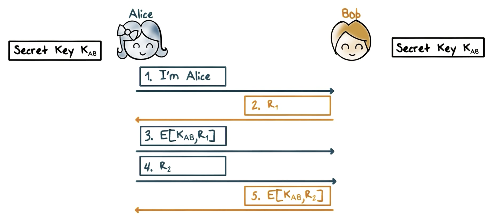
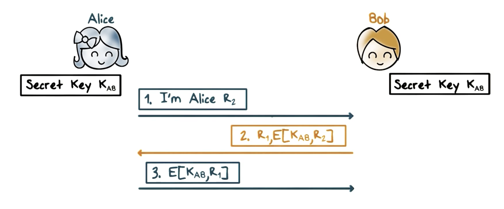
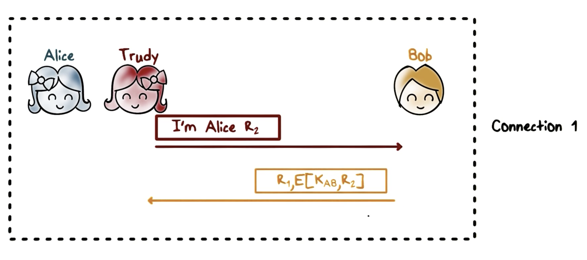
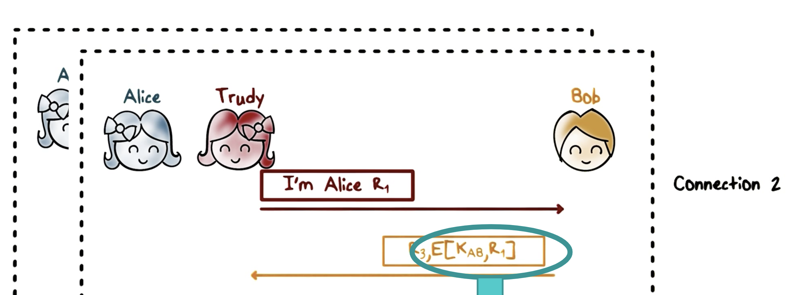
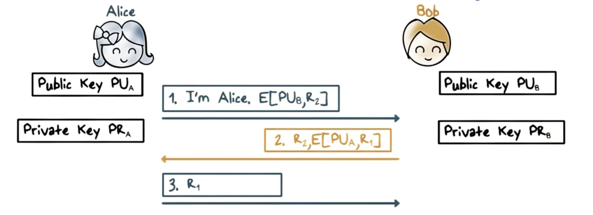
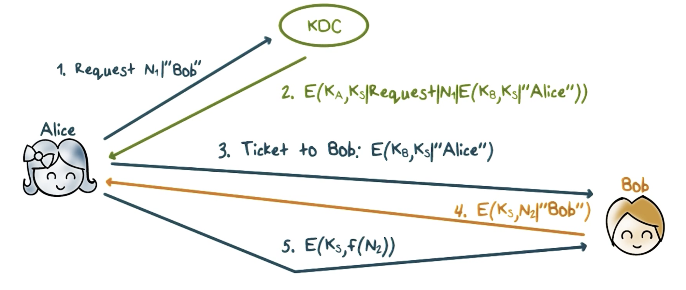
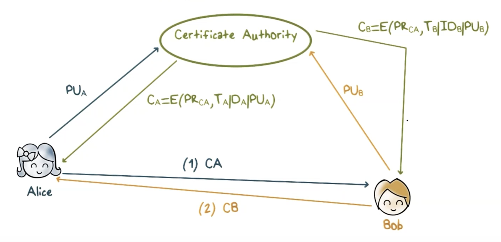

# Security Protocols
- example: if Alice and Bob want to communicate over the internet securely
    - mutually authenticate
    - establish/exchange secret keys
    - agree to crypto operations and algos
- building blocks: public key (asymmetric) and secret key (symmetric) algorithms, hash functions

    - assume alice and bob have established shared secret key (K_ab)
    - alice sends "i'm alice"
    - bob will generate random number R1 and send it to alice
    - alice will encrypt with the shared key and the random number R1 and send it to bob
    - alice will generate its own random number R2 and send it to bob
    - bob will encrypt the shared key and random number R2 and sends it to alice
        - alice verifies this by decrypting using the secret key and checking if R2 is the same
- R1 and R2 should not be predictable/easily repeatable
    - use large random values
    - shared key must be protected at endpoints of communication
- if R1 and R2 are predicatable,
    - attacker in the middle can record previous conversation and use the previous value of R1/R2 to impersonate the other user 

## Reflection Attack

- problem with this scheme:
    - an attacker can impersonate another user by creating multiple connections to bob
        - create 1 connection with R2, bob encrypts R2 with secret key, sends it with R1
        - 
        - create another connection with R1, bob encrypts it with R1 and secret key, sends it back with R3
        - 
        - attacker just got bob to encrypt message for him/her!
- fix: have different keys for initiator and responder
## Mutual Authentication Using Public/Private Keys

- instead of encrypting, sign messages instead
- alice encrypts R2 using bob's public key and
    - only bob can decrypt this value suing private key, and can read R2
- bob then picks random value R1 and encrypts it using alice's public key
    - alice decrypts using private key, sends back R1 to bob

## Session Keys
- authentication first
    - new key used for each session
- use shared secret (master key)
    - used to authenticate/establish new session key
- use public keys
- establish a shared key for the session, even if there already is a shared secret key
- advantage of session key: if it is compromised, master key will not be

### Establishing Session Key
- Alice encrypts a random session key with bob's public key, then encrypts that value with alice's private key, and sends it to bob
    - Encrypt(PR_a, Encrypt(PU_b, K))
        - K = random key
    - Bob can decrypt using alice's public key, then grab the session key using bob's private key
- another option is to use diffie hellman with signing

## Key Distribution Center (KDC)
- symmetric keys
- shared master keys do not scale well 
    - each communication pair needs to share a master key
- K_a (key alice shares with the KDC), K_b (key bob shares with KDC)

1. alice makes request with random value N1 asking to talk to bob to KDC
2. KDC responds with a message containing E(K_b K_s | "Alice"), appends N1 and request, and Encrypts entire thing using alice's key (K_a)
    1. K_b = bob's key, K_s = session key, only bob can know this value
3. alice ends bob the encrypted blob that the KDC sent her (E(K_b K_s | "Alice"))
4. bob then responds with it's own random message N2 encrypted with the session key from decrypting alice's message from step 3
5. alice knows session key by decrypting message, and sends N2 message encrpyted with K_s, performing some function on N2 before encrypting it

## Exchanging Public Key Certificates

- asymmetric keys
- alice and bob will send public keys to certificate authority to be signed
    - certificate authority will encrypt using T (timestamp), D (ID number), and corresponding public key
    - will return a certificate to Alice/bob, and will mutually authenticate using the certificates generated