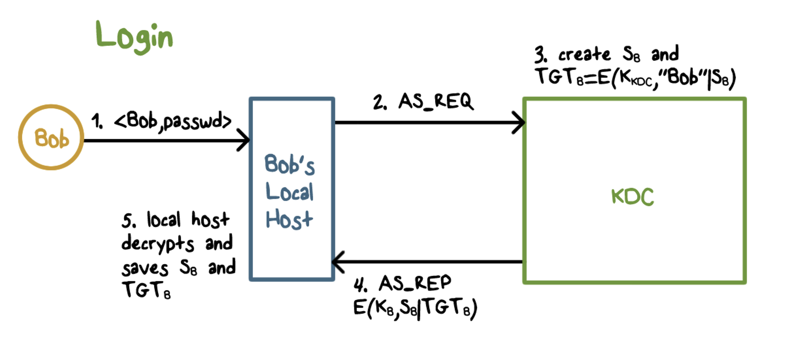
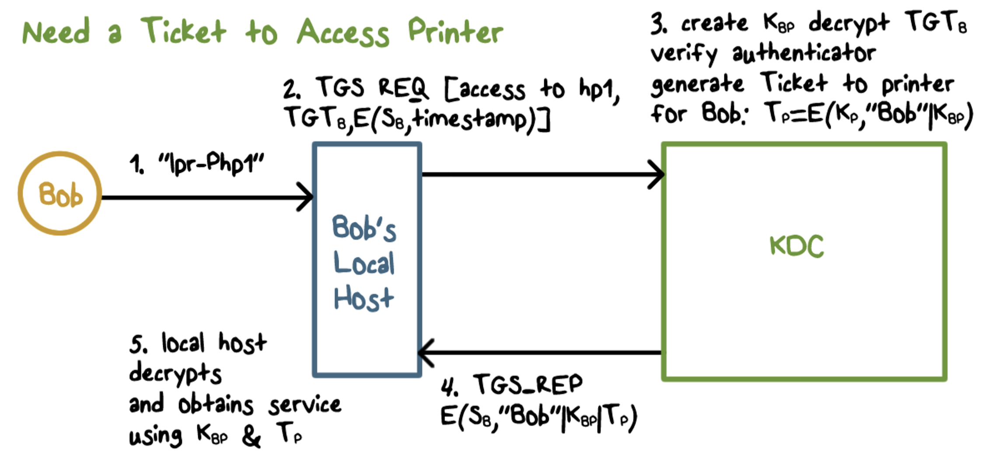
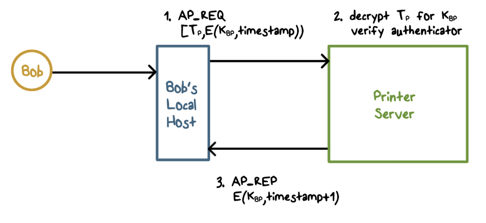
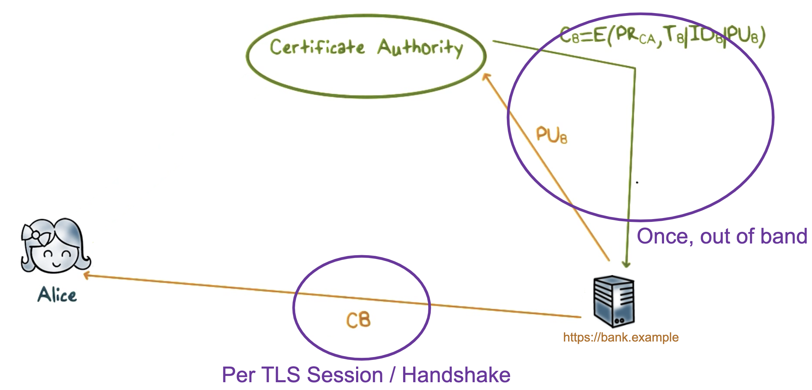
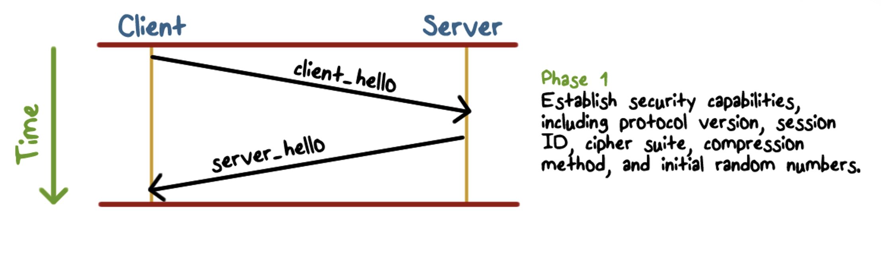
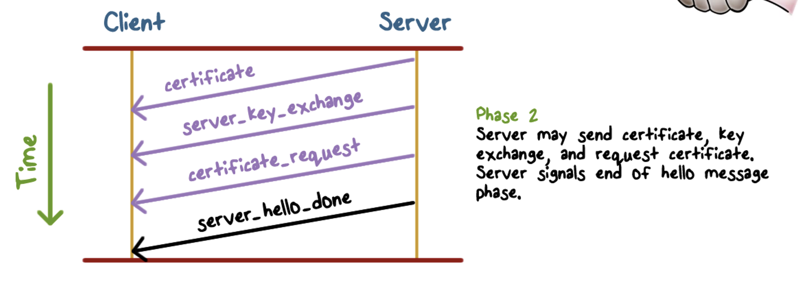
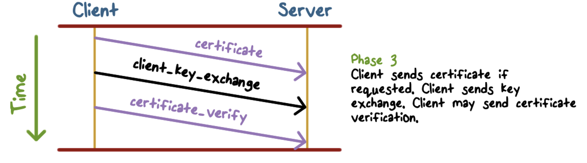
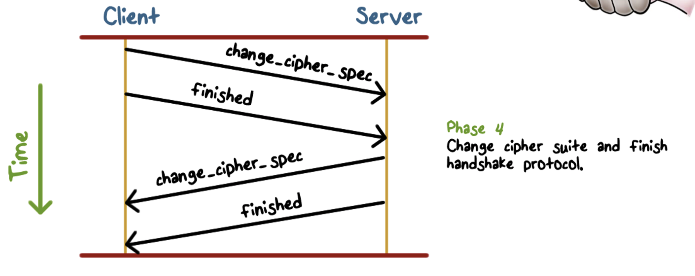

# Kerberos
- protocol that provides authentication and access control in a network environment
    - login and access resources in a network securely
- every principal has a master key
    - principals can be users or resources in the network (printer)
- all principals' master keys stored in KDC, protected/encrypted
- Tickets
    - limited lifetime cryptographic capability to access resources

1. bob logs in with password to local host
2. once logged in, kerberos generates an AS request, asks to authenticate to kerberos
3. kerberos creates session key for bob (S_b) and a ticket granting ticket (TGT)
    1. TGT is generated by encrypting an identifier to bob with bob's session key ("bob|S_b") with a key only known by the KDC (K_kdc)
    2. only KDC can decrypt TGT, verifying that bob did indeed previously authenticate
4. send TGT to bob by encrypting it using 
5. local host decrypts and saves S_b and TGT

## Kerberos Benefits
- localhost does not need to store passwords
- master key that user shares with KDC only used once per day
    - limits exposure

## Accessing Printer - Obtaining Ticket

1. bob asks to access printer named "lhr-php1"
2. local hosts sends a ticket granting service request - wants access to printer
    1. also sends TGT and Encrypted session key 
3. KDC verifies session key and TGT, then generates ticket for bob by creating a session key (K_bp) so that bob can access printer, and encrypt using the key for the printer
4. KDC sends ticket to access printer to localhost by encrypting it with bob's session key
5. localhost decrypts and obtains ticket to access printer 

## Accessing Printer

1. local host sends an authentication protocol request to printer by sending the ticket(T_p) and encrypting bob's timestamp by using bob's session key for the printer (K_bp)
2. printer decrypts ticket(T_p) by using K_p, and uses K_bp to decrypt the other part of the message to authenticate
3. printer sends response back to localhost, sends back timestamp + 1 encrypted using bob's printer session key

# TLS (Transport Layer Security)
- also called secure socket layer (SSL)
- one of the most widely used security services
- general purpose service implemented as set of protocols that rely on TCP

## TLS Concepts
- TLS session
    - association between client and server
    - created by the handshake protocol
    - defines set of crypto parameters
    - used to avoid having to negotiate new security parameters for each connection
        - many connections can use the same session
- TLS connection
    - a specific instantiation of communication between 2 hosts on internet
    - short lived peer to peer relationships
    - every connection has 1 session

## TLS Record Protocol

- app data broken into fragments, compressed, add a message authentication code (MAC), encrypted, append TLS record header, then sent to network

## Exchanging Public Key Certs With Web Server
- web server sends public key to certificate authority, gets back a certificate with metadata, sends that certificate to you

## Handshake protocol

- Parameters
    - version - highest TLS version understood by client
    - random - 32 bit timestamp and 28 bytes generated by a secure RNG
    - session id - variable length
    - ciphersuite - list containing combo of crypto algorithms supported by client
    - compression method - list of compression methods supported by client
- ciphersuite components
    - protocol - what protocol will be used (TLS)
    - key exchange - what algorithm we will use to establish session key (RSA, diffie hellman)
    - authentication - method used to authenticate key exchange
        - coupled to the certificate (typically RSA)
    - block cipher - symmetric block cipher algo for bulk encryption
    - block cipher mode - mode we will use to chain block ciphers
    - hash function for MAC - Hash function to be used as part of the HMAC
    - overall format
        - `Protocol_KeyExchange_Authentication_BlockCipher_Ciphermode_Hash`
        - example: `TLS_ECDHE_RSA_WITH_AES_128_CBC_SHA256`

- server sends certificate (got it from certificate authority)

- purple arrows indicate optional information that may/may not be sent