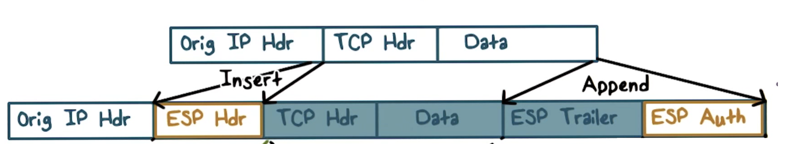

# IP Security
- goals of IPSec: authentication and confidentiality of IP packets
    - must verify source of IP packet
        - provide authentication that is lacking in IPv4
    - prevent replaying of old packets
    - automatically provide security for upper layer protocols
- why do we need authentication?
    - IP spoofing - computer simply modifies source IP address to victim's IP address
        - can query for lots of data to be sent from DNS server to victim's IP address, resulting in a DOS
## IPSec Modes
- transport mode
    - end-to-end security between end hosts on the internet
- tunnel mode
    - like VPN
    - takes traffic from one network and drops it into another network as if you were inside of that network
## IPSec Options
- ESP (encapsulated security payload)
    - provides confidentiality + authentication
    - encrypt/authenticate each packet
    - encryption is applied to each packet payload
    - authentication applied to data in IPSec header and payload after encryption is done
- AH (authentication header)
    - does not provide confidentiality, only authentication
    - authentication applied to entire packet, with IP header fields being zeroed out
    - can apply both ESP and AH, but AH must come after ESP
## Tunnel Mode
- IP headers change

### ESP Tunnel Mode

- only gives authenticity/security over original packet, not new packet (no integrity over new IP header)

### ESP Transport Mode

- used for end to end security between hosts
- first insert ESP header, then append ESP trailer and auth
- difference between tunnel and transport

## Authentication Header

### AH In Transport Mode

### AH In Tunnel Mode

## Internet Key Exchange
- exchange and negotiate security policies
- establish parameters
    - security associations
- key exhanging

### Security Association
- one-way relationship between sender and receiver - defined by IPsec params
- one SA for inbound traffic, one for outbound
- security associations database (SADB)
- security parameter index (SPI)
    - unique index for each entry in SADB
    - indentifies security association with a packet that is sent/received
- security policy database (SPDB)
    - stores policies used to establish security associations

### Internet Key Exchange Phases
- used when outbound packet requires IPSec but no security association has been established
- 2 phases
    - establish security association
    - use the internet key exchange security association to negotiate IPSec security associations
        - multiple IPSec security associations can be established using one internet key exchange security association
        - this internet key exchange security association is bidirectional
- internet key exchange security association used to define encryption and authentication of internet key exchange traffic 

#### Phase 1: Creating Internet Key Exchange Security Association 
- negotiate protection suite, crypto algos
- establish shared secret
    - diffie-hellman
- authenticate secret key (Internet Key Exchange Security Association) using some pre-shared secret key or root of trust between user and key exchange

#### IKE Phase 2 Keys
- how do we establish IPSec security associations?  
    - same as phase 1, but with new information
- each time an IPsec SA is established

## IPSec Tunnel

- overall, process is very expensive and not widely adopted