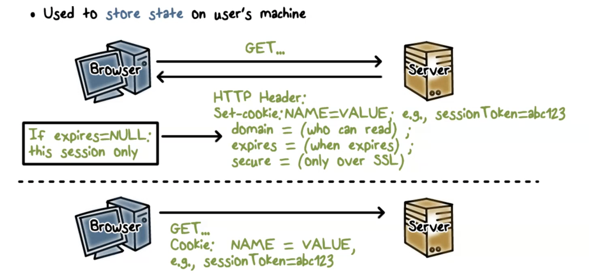
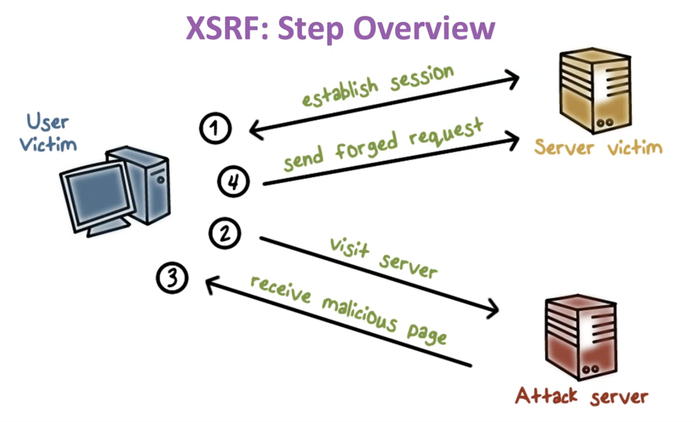
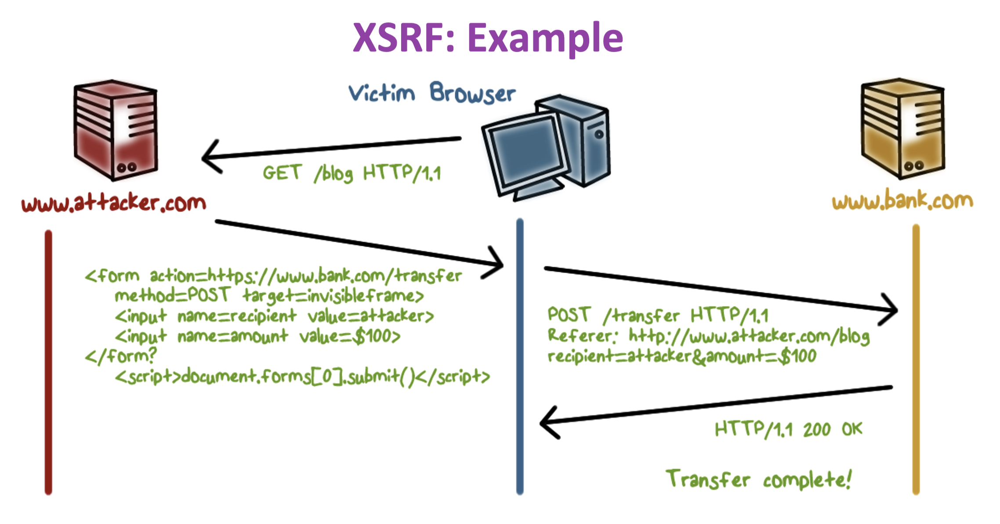
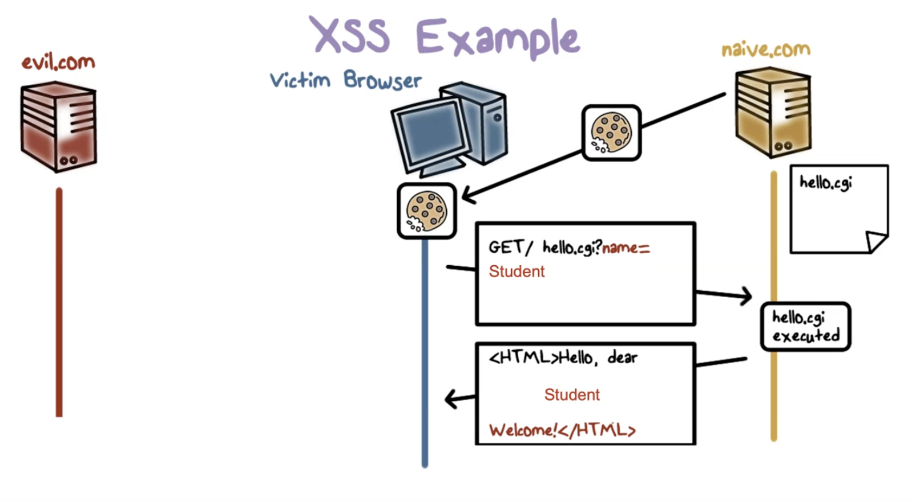
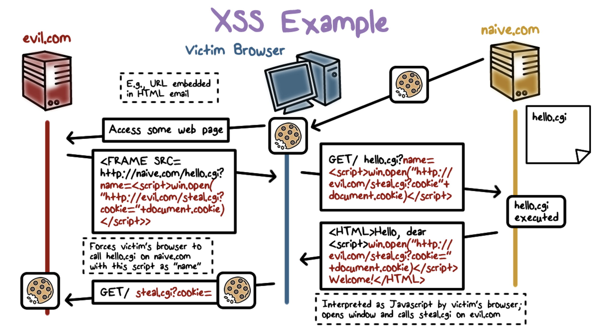

# Web Security
- cross site scripting (xss)
- cross site request forgery (CSRF)
- sql injection
- typically how user interacts with web
    - browser client sends requests to web server
    - webserver will interact with static content (files), or dynamic content (scripts)
- cookies - used to store user state on their machine
    - goal of attacker is to obtain this user state info to impersonate user

## How User/Web Interaction Works
- webpage contains static and dynamic contents (js)
    - sent from website, run on user's machine
- websites run apps to generate response/page
    - done according to requests from user/browser
    - often communicate with backend servers

## XSRF - Cross Site Request Forgery
- problem
    - HTTP requests are stateless
    - cookies are reused automatically
- malicious script can make forged requests to site using user's cookies
- browser running a malicious script from bad site can make requests to run a script on a good site

- user interacts with a server for a website user typically engages with
- user visits attacker's website
- attacker's website sends user malicious webpage which has script, which sends forged request to other webserver

- web form for bank returned by bank webserver
- attacker forges request for user to transfer money to the attacker
### XSRF Fix
- Form submissions should require proof the request was initiated by a visit to the website
    - Attack can generate the request, but can’t see the form presented to a user (attacker simply guessing)
- XSRF cookies - nonce that is embedded in forms that must be sent with requests
    - typically an XSRF token that is a random value

## XSS - Cross Site Scripting
- if a website allows users to input content without controls, then attacker can insert malicious code into webpages viewed by other users
    - typically user input
- example: user input for name, attacker puts in javascript string `` as his “name”
- The script will be included in the html page sent to the user’s browser; and when the script runs, the alert “Hello World” will be displayed for other users
    - imagine if this script is malicious
- example

- naive.com runs hello.cgi script - when user sends GET request with name, naive webserver returns HTML page with name

- somehow, victim's browser visits evil.com
- evil.com returns a frame that has a GET request to naive.com embedded in it, with javascript text that steals the user's cookie as its name
- request is sent to naive.com, and webserver returns HTML with malicious javascript embedded into it to the user's browser, which is executed
- user browser executes script, and evil.com obtains user's cookie
- solution: sanitize inputs

## XSRF vs XSS
- XSS
    - user trusts badly implemented website that does not sanitize inputs
    - Attacker injects a scriptinto the trusted website
    - user's browser executes attacker script
- XSRF
    - badly implemented website trusts user
    - attacker uses user's browser to send requests
    - website executes attacker's requests
## SQL Injection
- example: logging into website
    - attacker puts SQL into user input, sent to server and executes user input in SQL query, resulting in attacks
- solution: allow only well-defined set of safe values (whitelisting)