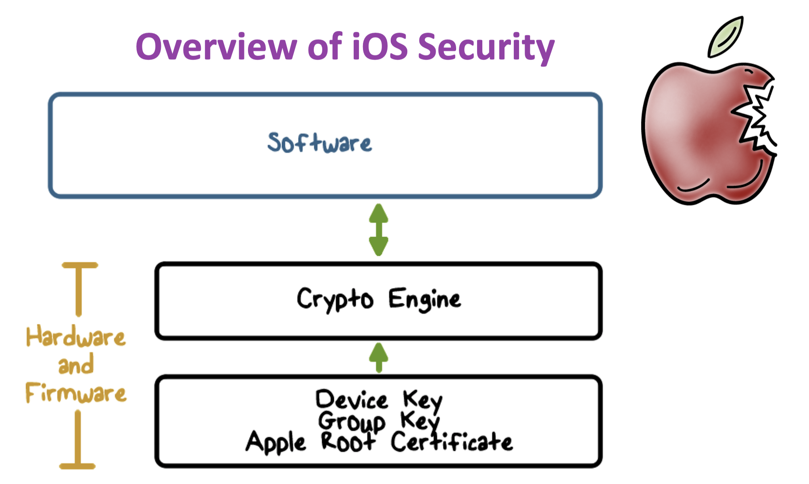
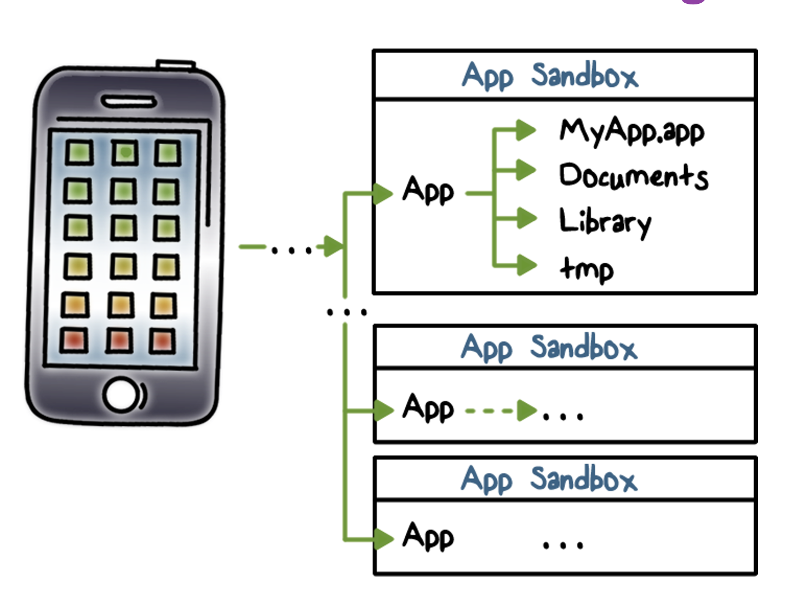
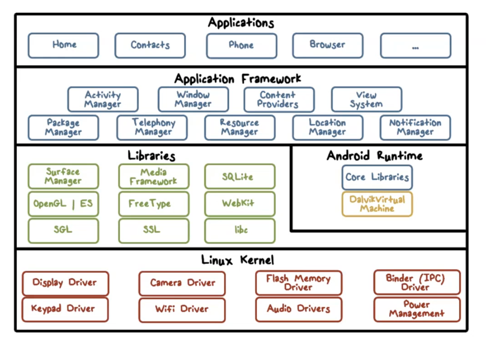

# Wireless/Mobile Security
- Wifi security, iOS/Android security
- wifi access point connected to internet, devices connected to WAP wirelessly
    - Eavesdropping, Injecting bogus messages, Replaying previously recorded messages, Denial-of-service, Illegitimate access to the network & its services
- security standard for wifi was WEP, now 802.11i (WPA2 - wifi protected access 2)

## Overview of 802.11i
- access control model based on 802.1X
    - flexible authentication framework - Carrier protocol designed to transport the messages of real authentication protocols (TLS - transport layer security)
- advantages
    - authentication results in shared session key (prevents session hijacking)
    - different operations (encryption, integrity) use different keys derived from session key using one-way function
    - improved integrity/encryption protection

## iOS Security

- hardware designed to perform crypto operations fast

### Hardware Security Features
- Each iOS device has a dedicated AES-256 crypto engine
- manufacture keys
    - Apple provides the Device ID (UID) and the device group ID  (GID) as AES 256 Bit keys
    - While the UID is unique to each device, the GID represents a processor class (e.g., Apple A5 processor
    - The UID and GID keys are directly burned into the silicon and can only be accessed by the Crypto Engine
- BootChain
    - verify each stage using cryptographic signatures, up until kernel loading

### File Data Encryption
- every file encrypted with unique file key - generated when file created
- file key wrapped in class key
- file metadata encrypted with file system key
- class key protected by device UID and user passcode
### Mandatory code signing
- all executable code has to be signed by trusted party
- apps from app store are signed by Apple
- no dynamic code generation/self modifying
- code signing check
    - when app loads, OS checks crypto signature of app before it can run
### Restricted App Distribution Model
- Third-party apps have to be reviewed by Apple; the apps that passed the review are signed by Apple
- iOS devices are only allowed to download apps through the App Store

## Sandboxing
- Each app has a unique home directory for its files
- Apps are restricted from accessing files stored by other apps or from making changes to the device

## ASLR, Non Executable Stack/Heap
- Prevents code-injection attacks/buffer overflow

### Passcodes, Touch ID, and Face ID
- hardware rate limited
- convenient

## Android Security

- built on linux kernel, custom linux environment
- runs on Dalvik VM (similar to JVM)
### Sandboxing
- Each application runs with its UID in its own Dalvik virtual machine
- Applications announces permission requirement
    - User grants access permissions at run-time

### Code Signing
- All apps self-signed by developers
- Code signing is used for
    - app updates
    - code/data sharing between apps