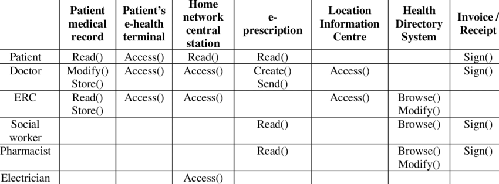

# Access Control
- now that we have verfied the user, how do we decide to grant the user access to that resource?
    - example: should John's process be allowed to read a certain file?
- who is allowed to access what
    - decide who should have access to certain resources (access control policy)
    - only accesses defined by the access control policy are granted (enforcement)
- complete mediation needed for enforcement

## Access Control Matrix (ACM)
- abstraction to represent access control state
    - defines who can access what 
- rows = users
- cols = protected resources

### Access Control List
- Each entry in list is a protected resource, and the value at each entry is a list of all users and their permissions to the protected resource
    - for our example, it would be 
    - `Patient Medical Record -> [(Patient, R),(Doctor, MS), (ERC, RS)]`
    - `Location Info Center ->[(doctor, A), (ERC, A)]`
- should be stored in trusted part of system
    - contains access control entries with other resource metadata
    - checking if user has access requires traversal of ACL
### Capability List (C-List)
- Each entry in list is a user, and the value at each entry is a list of all files they have permissions for
    - for example, the C-list would be 
    - `Alice -> [(File1, RW),(File2, R)]`
    - `Bob -> [(File3, RWX),(File4, X)]`
- can be stored with principles themselves

## Access Control Implementation
- in unix systems, each resource is like a file
- each file has an owner and access is possible for owner, group, and everyone
    - permissions are read, write, execute
- how are files used?
    - create `filename`
    - `fd = open(filename, mode)`
    - `read(fd, buf, siszeof(buf))`
    - `write(fd, buf, siszeof(buf))`
    - `close(fd)`
- *time to check vs time to use vulnerability*
    - file permissions change after an open() call and before it is closed
    - possible solution: lock permissions of file while it is open
## Role Based Access Control (RBAC)
- used in enterprise settings
    - access rights associated with role
- users authenticate into system, then activate one or more roles for themselves
- no need for policy to be updated when person with role leaves org
    - new employees can activate desired role